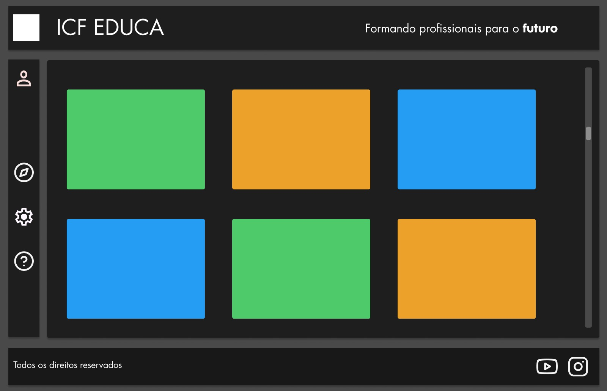

# ICF EDUCA - Plataforma de Cursos

<div align="center">
  
</div>

Uma plataforma moderna para visualização de cursos educacionais, desenvolvida com as mais recentes tecnologias web.

## 🚀 Tecnologias

Este projeto utiliza as seguintes tecnologias:

- [Next.js 14](https://nextjs.org/) - Framework React com App Router
- [React](https://reactjs.org/) - Biblioteca JavaScript para construção de interfaces
- [TypeScript](https://www.typescriptlang.org/) - Superset JavaScript com tipagem estática
- [Tailwind CSS](https://tailwindcss.com/) - Framework CSS utility-first
- [Lucide React](https://lucide.dev/) - Biblioteca de ícones

## 💻 Pré-requisitos

Antes de começar, verifique se você tem os seguintes requisitos:

- Node.js 18+ instalado
- npm ou yarn como gerenciador de pacotes

## 🚀 Instalação

1. Clone o repositório:
```bash
git clone https://github.com/seu-usuario/icf-educa.git
```

2. Acesse a pasta do projeto:
```bash
cd icf-educa
```

3. Instale as dependências:
```bash
npm install
# ou
yarn install
```

4. Inicie o servidor de desenvolvimento:
```bash
npm run dev
# ou
yarn dev
```

5. Acesse `http://localhost:3000` no seu navegador

## 📝 Estrutura do Projeto

```
src/
  ├── app/
  │   ├── components/     # Componentes React
  │   ├── fonts/         # Fontes do projeto
  │   ├── layout.tsx     # Layout principal
  │   └── page.tsx       # Página inicial
  └── ...
```

## 🤝 Contribuindo

Contribuições são sempre bem-vindas! Para contribuir:

1. Fork o projeto
2. Crie uma branch para sua feature (`git checkout -b feature/AmazingFeature`)
3. Commit suas mudanças (`git commit -m 'Add some AmazingFeature'`)
4. Push para a branch (`git push origin feature/AmazingFeature`)
5. Abra um Pull Request

## 👨‍💻 Autor

Seu Nome - [God and his son](https://github.com/raulhprimo)
